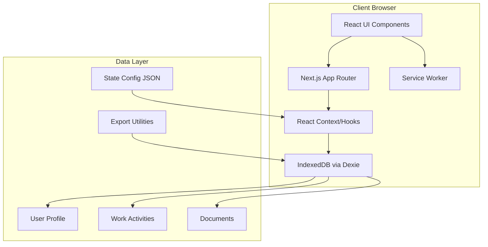

# Design Document: WorkPath (MVP)

**Your Work Requirements Assistant**

*Track your work, volunteer, and education hours to maintain your Medicaid and SNAP benefits*

---

## Overview

This design document outlines the complete technical architecture, component structure, data models, and implementation approach for WorkPath. The application is built using Next.js 14+ with the App Router, Material-UI v5+, and IndexedDB for local-first data storage.

WorkPath prioritizes mobile-first user experience, offline functionality, data privacy, and accessibility compliance. All data is stored locally on the user's device with no external transmission except through explicit user-initiated exports.

**Design Completeness**: This document addresses all 15 requirements from the requirements document, aligns with the PWA Bootstrap Guide, and incorporates domain knowledge from the Medicaid Work Requirements Service Blueprint.

## Architecture

### High-Level Architecture



### Technology Stack

- **Framework**: Next.js 14+ (App Router, Static Export for GitHub Pages)
- **UI Library**: React 18+ with TypeScript strict mode
- **Component Library**: Material-UI (MUI) v5+
- **Styling**: Emotion (MUI's CSS-in-JS solution)
- **Data Storage**: IndexedDB via Dexie.js
- **Form Management**: React Hook Form with Zod validation
- **Date Handling**: date-fns
- **PWA**: next-pwa plugin with Workbox
- **Testing**: Jest + React Testing Library + Playwright
- **Build/Deploy**: GitHub Actions → GitHub Pages

### Application Structure

```
medicaid-compliance-assistant/
├── .github/
│   └── workflows/
│       └── deploy.yml
├── .kiro/
│   └── steering/
│       ├── development-standards.md
│       ├── material-ui-guidelines.md
│       ├── git-workflow.md
│       └── medicaid-domain-knowledge.md
├── docs/
│   ├── domain/
│   ├── design/
│   ├── testing/
│   └── development/
├── public/
│   ├── icons/
│   ├── config/
│   │   └── federal-baseline.json
│   ├── manifest.json
│   └── sw.js
├── src/
│   ├── app/
│   │   ├── layout.tsx
│   │   ├── page.tsx
│   │   ├── onboarding/
│   │   │   └── page.tsx
│   │   ├── exemptions/
│   │   │   ├── page.tsx
│   │   │   └── rescreen/page.tsx
│   │   ├── tracking/
│   │   │   ├── page.tsx
│   │   │   └── batch/page.tsx
│   │   ├── documents/
│   │   │   ├── page.tsx
│   │   │   └── [id]/page.tsx
│   │   ├── export/
│   │   │   └── page.tsx
│   │   ├── import/
│   │   │   └── page.tsx
│   │   └── settings/
│   │       └── page.tsx
│   ├── components/
│   │   ├── common/
│   │   │   ├── AppBar.tsx
│   │   │   ├── BottomNav.tsx
│   │   │   ├── LoadingSpinner.tsx
│   │   │   ├── ErrorBoundary.tsx
│   │   │   ├── ConfirmDialog.tsx
│   │   │   └── SnackbarNotification.tsx
│   │   ├── forms/
│   │   │   ├── FormField.tsx
│   │   │   ├── DatePicker.tsx
│   │   │   ├── DateRangePicker.tsx
│   │   │   ├── FileUpload.tsx
│   │   │   └── MultiDatePicker.tsx
│   │   ├── layout/
│   │   │   ├── PageContainer.tsx
│   │   │   └── Section.tsx
│   │   ├── exemptions/
│   │   │   ├── ExemptionQuestion.tsx
│   │   │   ├── ExemptionSummary.tsx
│   │   │   ├── ExemptionCard.tsx
│   │   │   └── ExemptionComparison.tsx
│   │   ├── tracking/
│   │   │   ├── Calendar.tsx
│   │   │   ├── ActivityEntry.tsx
│   │   │   ├── BatchActivityEntry.tsx
│   │   │   ├── ComplianceDashboard.tsx
│   │   │   ├── MonthSummary.tsx
│   │   │   ├── ActivityList.tsx
│   │   │   └── IncomeTracker.tsx
│   │   ├── documents/
│   │   │   ├── DocumentList.tsx
│   │   │   ├── DocumentCard.tsx
│   │   │   ├── DocumentFilter.tsx
│   │   │   ├── CameraCapture.tsx
│   │   │   ├── DocumentViewer.tsx
│   │   │   ├── DocumentForm.tsx
│   │   │   └── DocumentActivityLinker.tsx
│   │   ├── export/
│   │   │   ├── ExportOptions.tsx
│   │   │   ├── ExportPreview.tsx
│   │   │   └── ExportHistory.tsx
│   │   ├── import/
│   │   │   ├── ImportUpload.tsx
│   │   │   ├── ImportPreview.tsx
│   │   │   └── ImportMergeDialog.tsx
│   │   └── settings/
│   │       ├── ProfileEditor.tsx
│   │       ├── DataManagement.tsx
│   │       ├── StorageInfo.tsx
│   │       ├── StorageWarning.tsx
│   │       ├── PrivacyPolicy.tsx
│   │       └── AboutApp.tsx
│   ├── hooks/
│   │   ├── useDatabase.ts
│   │   ├── useExemptions.ts
│   │   ├── useCompliance.ts
│   │   ├── useDocuments.ts
│   │   ├── useOfflineStatus.ts
│   │   ├── useStorageQuota.ts
│   │   └── useIncome.ts
│   ├── lib/
│   │   ├── storage/
│   │   │   ├── db.ts
│   │   │   ├── profile.ts
│   │   │   ├── activities.ts
│   │   │   ├── documents.ts
│   │   │   └── encryption.ts
│   │   ├── validation/
│   │   │   ├── profile.ts
│   │   │   ├── exemptions.ts
│   │   │   ├── activities.ts
│   │   │   └── documents.ts
│   │   ├── export/
│   │   │   ├── json.ts
│   │   │   ├── markdown.ts
│   │   │   └── import.ts
│   │   ├── config/
│   │   │   ├── loader.ts
│   │   │   └── federal-baseline.json
│   │   └── utils/
│   │       ├── date.ts
│   │       ├── calculations.ts
│   │       ├── formatting.ts
│   │       └── storage.ts
│   ├── theme/
│   │   ├── theme.ts
│   │   ├── colors.ts
│   │   └── typography.ts
│   └── types/
│       ├── profile.ts
│       ├── exemptions.ts
│       ├── activities.ts
│       ├── documents.ts
│       ├── config.ts
│       └── errors.ts
└── tests/
    ├── __mocks__/
    ├── components/
    ├── integration/
    └── e2e/
```

## Data Models

### TypeScript Interfaces


```typescript
// types/profile.ts
export interface UserProfile {
  id: string;
  name: string;
  dateOfBirth: string;
  state: string;
  medicaidStatus: 'enrolled' | 'applying' | 'not-enrolled';
  createdAt: string;
  updatedAt: string;
}

// types/exemptions.ts
export interface ExemptionScreening {
  id: string;
  userId: string;
  screeningDate: string;
  isExempt: boolean;
  exemptionCategories: ExemptionCategory[];
  responses: ExemptionResponse[];
}

export type ExemptionCategory = 
  | 'age'
  | 'family-caregiving'
  | 'health-disability'
  | 'program-participation'
  | 'other';

// types/activities.ts
export interface WorkActivity {
  id: string;
  userId: string;
  date: string;
  type: 'work' | 'volunteer' | 'education';
  hours: number;
  organization: string;
  income?: number;
  payPeriod?: 'hourly' | 'daily' | 'weekly' | 'monthly';
  notes?: string;
  documentIds: string[];
  createdAt: string;
  updatedAt: string;
}

// types/documents.ts
export interface Document {
  id: string;
  userId: string;
  type: DocumentType;
  description: string;
  date: string;
  captureDate: string;
  imageBlobId: string;
  isSubmitted: boolean;
  submittedDate?: string;
  linkedActivityIds: string[];
  createdAt: string;
}

export type DocumentType = 
  | 'pay-stub'
  | 'volunteer-verification'
  | 'school-enrollment'
  | 'medical-documentation'
  | 'other';

// types/compliance.ts
export interface MonthlyCompliance {
  id: string;
  userId: string;
  month: string;
  totalHours: number;
  workHours: number;
  volunteerHours: number;
  educationHours: number;
  totalIncome: number;
  isCompliant: boolean;
  activityIds: string[];
  calculatedAt: string;
}
```

### IndexedDB Schema

```typescript
// lib/storage/db.ts
import Dexie, { Table } from 'dexie';

export class MedicaidComplianceDB extends Dexie {
  profiles!: Table<UserProfile>;
  exemptions!: Table<ExemptionScreening>;
  activities!: Table<WorkActivity>;
  documents!: Table<Document>;
  documentBlobs!: Table<{ id: string; blob: Blob }>;
  compliance!: Table<MonthlyCompliance>;

  constructor() {
    super('MedicaidComplianceDB');
    this.version(1).stores({
      profiles: 'id, createdAt',
      exemptions: 'id, userId, screeningDate',
      activities: 'id, userId, date, type',
      documents: 'id, userId, date, type, isSubmitted',
      documentBlobs: 'id',
      compliance: 'id, userId, month'
    });
  }
}
```

## Core Components (Detailed Specifications)

### 1. Batch Activity Entry Component

**Purpose**: Allow users to log hours for multiple dates at once (Requirement 4.10)

**Component**: `BatchActivityEntry.tsx`

**UI Layout**:
- Multi-date selector (calendar with checkboxes)
- Activity type dropdown (work/volunteer/education)
- Hours input (applies to all selected dates)
- Organization name input
- Optional notes
- Preview list of entries to be created
- Bulk save button

**User Flow**:
1. User clicks "Batch Entry" button from calendar
2. Multi-date picker opens
3. User selects multiple dates (checkboxes on calendar)
4. User fills in activity details (type, hours, organization)
5. Preview shows "Creating 5 entries for Jan 1, 2, 3, 4, 5"
6. User confirms
7. System creates individual activities for each date
8. Success message shows "5 activities created"

**TypeScript Interface**:
```typescript
interface BatchActivityInput {
  dates: string[];
  type: 'work' | 'volunteer' | 'education';
  hours: number;
  organization: string;
  income?: number;
  notes?: string;
}
```

**Validation**:
- At least one date must be selected
- Hours must be 0-24
- Organization name required
- Warn if creating duplicate entries for existing dates


### 2. Income Tracking Component

**Purpose**: Track income to determine $580/month threshold compliance (Requirement 5.6-5.8)

**Component**: `IncomeTracker.tsx`

**UI Layout**:
- Income summary card showing monthly total
- Threshold indicator ($580/month)
- Compliance status badge
- List of work activities with income
- "Add Income" button for activities

**Integration with WorkActivity**:
- When logging work hours, optional income field appears
- Pay period selector (hourly, daily, weekly, monthly)
- Automatic calculation to monthly equivalent
- Income displayed in activity list

**Calculations**:
```typescript
function calculateMonthlyIncome(activities: WorkActivity[]): number {
  return activities
    .filter(a => a.type === 'work' && a.income)
    .reduce((total, activity) => {
      const monthlyIncome = convertToMonthly(
        activity.income!,
        activity.payPeriod || 'monthly'
      );
      return total + monthlyIncome;
    }, 0);
}

function convertToMonthly(income: number, period: PayPeriod): number {
  switch (period) {
    case 'hourly': return income * 160; // ~40hrs/week * 4 weeks
    case 'daily': return income * 22; // ~22 workdays/month
    case 'weekly': return income * 4.33; // ~4.33 weeks/month
    case 'monthly': return income;
  }
}
```

**Display**:
- Progress bar toward $580 threshold
- Green checkmark if >= $580
- Warning if < $580 and < 80 hours
- Breakdown by pay period

### 3. Document Filter Component

**Purpose**: Filter documents by type and date range (Requirement 7.3)

**Component**: `DocumentFilter.tsx`

**UI Layout**:
- Filter button with badge showing active filter count
- Filter panel (drawer on mobile, popover on desktop)
- Document type multi-select checkboxes
- Date range picker (from/to)
- "Clear Filters" button
- "Apply" button

**Filter State**:
```typescript
interface DocumentFilters {
  types: DocumentType[];
  dateFrom?: string;
  dateTo?: string;
}
```

**Behavior**:
- Filters applied on "Apply" click
- Active filters shown as chips below filter button
- Click chip to remove individual filter
- Filter count badge on filter button
- Persists filters in component state (not IndexedDB)

**Implementation**:
```typescript
function filterDocuments(
  documents: Document[],
  filters: DocumentFilters
): Document[] {
  return documents.filter(doc => {
    if (filters.types.length > 0 && !filters.types.includes(doc.type)) {
      return false;
    }
    if (filters.dateFrom && doc.date < filters.dateFrom) {
      return false;
    }
    if (filters.dateTo && doc.date > filters.dateTo) {
      return false;
    }
    return true;
  });
}
```

### 4. Export Preview Component

**Purpose**: Preview export data before download (Requirement 9.10)

**Component**: `ExportPreview.tsx`

**UI Layout**:
- Modal dialog (full-screen on mobile)
- Tab switcher (JSON / Markdown)
- Preview area with syntax highlighting
- Scroll to review content
- Date range filter at top
- "Download" button
- "Cancel" button

**JSON Preview**:
- Syntax-highlighted JSON
- Collapsible sections
- Copy to clipboard button
- File size indicator

**Markdown Preview**:
- Rendered markdown with styling
- Table of contents
- Print-friendly formatting
- Copy to clipboard button

**Implementation**:
```typescript
interface ExportPreviewProps {
  open: boolean;
  onClose: () => void;
  onDownload: (format: 'json' | 'markdown') => void;
  data: ExportData;
  dateRange?: { from: string; to: string };
}
```

**Features**:
- Real-time preview updates when date range changes
- Format toggle without closing modal
- Keyboard shortcuts (Cmd/Ctrl+D to download, Esc to close)
- Loading state while generating preview


### 5. Import Merge Strategy Component

**Purpose**: Handle data import with merge/replace options (Requirement 10.5-10.6)

**Component**: `ImportMergeDialog.tsx`

**UI Layout**:
- Step 1: File upload and validation
- Step 2: Import preview (record counts)
- Step 3: Merge strategy selection
- Step 4: Confirmation
- Progress indicator

**Merge Strategies**:

1. **Replace All Data**:
   - Deletes all existing data
   - Imports all data from file
   - Warning: "This will permanently delete all your current data"
   - Requires typing "DELETE" to confirm

2. **Merge with Existing**:
   - Keeps existing data
   - Adds new records from import
   - Skips duplicates (by ID)
   - Updates records if ID exists and import is newer

**UI Flow**:
```typescript
interface ImportStep {
  step: 1 | 2 | 3 | 4;
  file?: File;
  data?: ImportData;
  strategy?: 'replace' | 'merge';
  confirmed: boolean;
}
```

**Step 1 - Upload**:
- Drag-and-drop zone
- File input button
- Validates JSON structure
- Shows error if invalid

**Step 2 - Preview**:
- Display counts:
  - X activities
  - X documents (metadata only)
  - X exemption screenings
  - 1 profile
- "Next" button

**Step 3 - Strategy**:
- Radio buttons for replace/merge
- Detailed explanation of each option
- Warning for replace option
- "Next" button

**Step 4 - Confirm**:
- Summary of action
- For replace: text input requiring "DELETE"
- For merge: simple confirmation
- "Import" button
- Progress bar during import

**Error Handling**:
- Rollback on failure
- Display specific error message
- Option to retry or cancel

### 6. Document-Activity Linking Component

**Purpose**: Link documents to activities (Requirement 7.4-7.5)

**Component**: `DocumentActivityLinker.tsx`

**UI Contexts**:

**From Document View**:
- "Link to Activity" button
- Opens modal with activity list
- Filter activities by date (near document date)
- Select one or more activities
- Save links

**From Activity View**:
- "Attach Document" button
- Opens document picker
- Shows thumbnails of documents
- Filter by date range
- Select one or more documents
- Save links

**Modal Layout**:
- Search/filter bar
- List of items (activities or documents)
- Checkbox selection
- Date and type displayed
- "Link Selected" button
- "Cancel" button

**Visual Indicators**:
- Document card shows "Linked to 2 activities" badge
- Activity entry shows document thumbnails
- Click thumbnail to view document
- Unlink button (X icon) on each link

**Implementation**:
```typescript
async function linkDocumentToActivity(
  documentId: string,
  activityId: string
): Promise<void> {
  const doc = await db.documents.get(documentId);
  if (doc && !doc.linkedActivityIds.includes(activityId)) {
    doc.linkedActivityIds.push(activityId);
    await db.documents.put(doc);
  }
  
  const activity = await db.activities.get(activityId);
  if (activity && !activity.documentIds.includes(documentId)) {
    activity.documentIds.push(documentId);
    await db.activities.put(activity);
  }
}
```

### 7. File Upload Fallback Component

**Purpose**: Allow file upload for users without camera (Requirement 7.8)

**Component**: `FileUpload.tsx`

**UI Layout**:
- Drag-and-drop zone
- "Choose File" button
- Accepted formats displayed
- File size limit displayed
- Preview after selection
- Same metadata form as camera capture

**Features**:
- Accept: JPEG, PNG, HEIC
- Max size: 10MB (configurable)
- Image preview before saving
- Compression option if > 5MB
- Same flow as camera capture after file selected

**Implementation**:
```typescript
interface FileUploadProps {
  onFileSelected: (file: File) => void;
  acceptedFormats: string[];
  maxSizeMB: number;
}
```

**Validation**:
- Check file type
- Check file size
- Display error if invalid
- Offer compression for large files


### 8. Storage Quota Warning Component

**Purpose**: Monitor storage and warn users (Requirement 6.10)

**Hook**: `useStorageQuota.ts`

```typescript
interface StorageQuota {
  used: number;
  total: number;
  percentUsed: number;
  shouldWarn: boolean;
}

export function useStorageQuota(): StorageQuota {
  const [quota, setQuota] = useState<StorageQuota>({
    used: 0,
    total: 0,
    percentUsed: 0,
    shouldWarn: false
  });

  useEffect(() => {
    async function checkQuota() {
      if ('storage' in navigator && 'estimate' in navigator.storage) {
        const estimate = await navigator.storage.estimate();
        const used = estimate.usage || 0;
        const total = estimate.quota || 0;
        const percentUsed = (used / total) * 100;
        
        setQuota({
          used,
          total,
          percentUsed,
          shouldWarn: percentUsed >= 80
        });
      }
    }
    
    checkQuota();
    const interval = setInterval(checkQuota, 60000); // Check every minute
    return () => clearInterval(interval);
  }, []);

  return quota;
}
```

**Component**: `StorageWarning.tsx`

**UI Layout**:
- Warning banner (appears at 80% capacity)
- Storage usage bar
- "Manage Storage" button
- Dismissible (but reappears on next session if still over 80%)

**Storage Management Page**:
- Total storage used / available
- Breakdown by type:
  - Documents: X MB (Y photos)
  - Activities: X KB
  - Profile: X KB
- List of largest documents with delete option
- "Delete Old Documents" button (older than 6 months)
- Confirmation dialogs for deletions

### 9. Exemption Re-screening Component

**Purpose**: Allow users to re-take exemption screening (Requirement 3.8)

**Component**: `ExemptionRescreen.tsx`

**UI Flow**:
1. User clicks "Re-screen for Exemptions" in settings
2. Warning dialog: "This will update your exemption status. Your previous screening will be saved for reference."
3. User confirms
4. Exemption screening flow starts
5. After completion, show comparison view

**Comparison View**: `ExemptionComparison.tsx`

**Layout**:
- Side-by-side comparison (stacked on mobile)
- Previous screening results (left/top)
- New screening results (right/bottom)
- Highlight differences
- "Keep New Results" button
- "Revert to Previous" button

**Data Storage**:
- New screening creates new ExemptionScreening record
- Previous screening remains in database
- User profile references current screening ID
- History of screenings available in settings

### 10. Settings Page Components

**Page**: `src/app/settings/page.tsx`

**Sections**:

1. **Profile Editor** (`ProfileEditor.tsx`):
   - Edit name, DOB, state, Medicaid status
   - Validation on save
   - Success/error feedback

2. **Data Management** (`DataManagement.tsx`):
   - Export Data button → opens export page
   - Import Data button → opens import page
   - Delete All Data button → confirmation dialog
   - Last export date displayed

3. **Storage Info** (`StorageInfo.tsx`):
   - Storage usage visualization
   - Breakdown by data type
   - "Manage Storage" button

4. **Privacy Policy** (`PrivacyPolicy.tsx`):
   - Full privacy policy text
   - Data handling explanation
   - User rights

5. **About App** (`AboutApp.tsx`):
   - App version
   - Build date
   - Credits
   - Open source licenses
   - Contact/support info

## State Management Strategy

### React Context Architecture

**Contexts**:

1. **AppContext**: Global app state
   - User profile
   - Current state configuration
   - Offline status

2. **ComplianceContext**: Compliance tracking state
   - Current month activities
   - Compliance calculations
   - Month navigation

3. **DocumentContext**: Document management state
   - Document list
   - Active filters
   - Storage quota

**Implementation**:
```typescript
// contexts/AppContext.tsx
interface AppState {
  profile: UserProfile | null;
  config: StateConfig;
  isOffline: boolean;
}

export const AppContext = createContext<AppState | null>(null);

export function AppProvider({ children }: { children: ReactNode }) {
  const [state, setState] = useState<AppState>({
    profile: null,
    config: federalBaseline,
    isOffline: !navigator.onLine
  });

  // Load profile on mount
  // Listen for online/offline events
  // Provide state and update functions

  return (
    <AppContext.Provider value={state}>
      {children}
    </AppContext.Provider>
  );
}
```

**Why Context over Redux/Zustand**:
- Simpler for this app size
- No complex state updates
- Most state is in IndexedDB
- Context sufficient for UI state


## Form Validation Strategy

### Zod Schemas

**Profile Validation**:
```typescript
// lib/validation/profile.ts
import { z } from 'zod';

export const profileSchema = z.object({
  name: z.string().min(1, 'Name is required').max(100),
  dateOfBirth: z.string().regex(/^\d{4}-\d{2}-\d{2}$/, 'Invalid date format'),
  state: z.string().min(1, 'State is required'),
  medicaidStatus: z.enum(['enrolled', 'applying', 'not-enrolled'])
});

export type ProfileFormData = z.infer<typeof profileSchema>;
```

**Activity Validation**:
```typescript
// lib/validation/activities.ts
export const activitySchema = z.object({
  date: z.string().regex(/^\d{4}-\d{2}-\d{2}$/),
  type: z.enum(['work', 'volunteer', 'education']),
  hours: z.number().min(0).max(24),
  organization: z.string().min(1, 'Organization is required').max(200),
  income: z.number().min(0).optional(),
  payPeriod: z.enum(['hourly', 'daily', 'weekly', 'monthly']).optional(),
  notes: z.string().max(500).optional()
});
```

**Document Validation**:
```typescript
// lib/validation/documents.ts
export const documentSchema = z.object({
  type: z.enum(['pay-stub', 'volunteer-verification', 'school-enrollment', 'medical-documentation', 'other']),
  description: z.string().min(1).max(200),
  date: z.string().regex(/^\d{4}-\d{2}-\d{2}$/)
});
```

### React Hook Form Integration

```typescript
import { useForm } from 'react-hook-form';
import { zodResolver } from '@hookform/resolvers/zod';

function ActivityEntryForm() {
  const { register, handleSubmit, formState: { errors } } = useForm({
    resolver: zodResolver(activitySchema)
  });

  const onSubmit = async (data: ActivityFormData) => {
    // Save to IndexedDB
  };

  return (
    <form onSubmit={handleSubmit(onSubmit)}>
      {/* Form fields with error display */}
    </form>
  );
}
```

## Loading States and Empty States

### Loading States

**Component-Level Loading**:
```typescript
function ComplianceDashboard() {
  const [loading, setLoading] = useState(true);
  const [data, setData] = useState<MonthlyCompliance | null>(null);

  useEffect(() => {
    async function loadData() {
      setLoading(true);
      const compliance = await calculateCompliance(currentMonth);
      setData(compliance);
      setLoading(false);
    }
    loadData();
  }, [currentMonth]);

  if (loading) {
    return <LoadingSpinner message="Calculating compliance..." />;
  }

  return <Dashboard data={data} />;
}
```

**Skeleton Screens**:
- Use MUI Skeleton components
- Match layout of loaded content
- Smooth transition to actual content

### Empty States

**No Activities Logged**:
```typescript
<EmptyState
  icon={<CalendarIcon />}
  title="No activities logged yet"
  description="Start tracking your work, volunteer, or education hours"
  action={
    <Button onClick={openActivityEntry}>
      Log Your First Activity
    </Button>
  }
/>
```

**No Documents**:
```typescript
<EmptyState
  icon={<CameraIcon />}
  title="No documents captured"
  description="Take photos of pay stubs, volunteer letters, and other verification documents"
  action={
    <Button onClick={openCamera}>
      Capture Document
    </Button>
  }
/>
```

**No Exemptions Found**:
```typescript
<EmptyState
  icon={<InfoIcon />}
  title="No exemptions found"
  description="You'll need to track 80 hours per month of work, volunteer, or education activities"
  action={
    <Button onClick={goToTracking}>
      Start Tracking Hours
    </Button>
  }
/>
```

## Error Handling Implementation

### Error Types

```typescript
// types/errors.ts
export class DatabaseError extends Error {
  constructor(message: string, public originalError?: Error) {
    super(message);
    this.name = 'DatabaseError';
  }
}

export class ValidationError extends Error {
  constructor(message: string, public field?: string) {
    super(message);
    this.name = 'ValidationError';
  }
}

export class StorageQuotaError extends Error {
  constructor(message: string, public usedMB: number, public totalMB: number) {
    super(message);
    this.name = 'StorageQuotaError';
  }
}

export class CameraError extends Error {
  constructor(message: string, public reason: 'permission' | 'not-available' | 'unknown') {
    super(message);
    this.name = 'CameraError';
  }
}
```

### Error Boundary

```typescript
// components/common/ErrorBoundary.tsx
export class ErrorBoundary extends React.Component<Props, State> {
  state = { hasError: false, error: null };

  static getDerivedStateFromError(error: Error) {
    return { hasError: true, error };
  }

  componentDidCatch(error: Error, errorInfo: React.ErrorInfo) {
    console.error('Error caught by boundary:', error, errorInfo);
  }

  render() {
    if (this.state.hasError) {
      return (
        <Box p={3}>
          <Alert severity="error">
            <AlertTitle>Something went wrong</AlertTitle>
            {this.state.error?.message || 'An unexpected error occurred'}
          </Alert>
          <Button onClick={() => this.setState({ hasError: false })}>
            Try Again
          </Button>
        </Box>
      );
    }

    return this.props.children;
  }
}
```

### Global Error Handler

```typescript
// lib/utils/errorHandler.ts
export function handleError(error: Error): void {
  if (error instanceof ValidationError) {
    // Show inline validation error
    showSnackbar(error.message, 'warning');
  } else if (error instanceof StorageQuotaError) {
    // Show storage warning
    showStorageWarning(error.usedMB, error.totalMB);
  } else if (error instanceof CameraError) {
    // Handle camera-specific errors
    if (error.reason === 'permission') {
      showSnackbar('Camera permission denied. Please enable in settings.', 'error');
    } else {
      showSnackbar('Camera not available. Use file upload instead.', 'info');
    }
  } else if (error instanceof DatabaseError) {
    // Show database error
    showSnackbar('Failed to save data. Please try again.', 'error');
    console.error('Database error:', error.originalError);
  } else {
    // Generic error
    showSnackbar('An unexpected error occurred', 'error');
    console.error('Unhandled error:', error);
  }
}
```


## PWA Configuration

### Service Worker Strategy

```javascript
// next.config.js
const withPWA = require('next-pwa')({
  dest: 'public',
  disable: process.env.NODE_ENV === 'development',
  register: true,
  skipWaiting: true,
  runtimeCaching: [
    {
      urlPattern: /^https:\/\/fonts\.(?:gstatic)\.com\/.*/i,
      handler: 'CacheFirst',
      options: {
        cacheName: 'google-fonts-webfonts',
        expiration: {
          maxEntries: 4,
          maxAgeSeconds: 365 * 24 * 60 * 60 // 1 year
        }
      }
    },
    {
      urlPattern: /\.(?:eot|otf|ttc|ttf|woff|woff2|font.css)$/i,
      handler: 'StaleWhileRevalidate',
      options: {
        cacheName: 'static-font-assets',
        expiration: {
          maxEntries: 4,
          maxAgeSeconds: 7 * 24 * 60 * 60 // 1 week
        }
      }
    },
    {
      urlPattern: /\.(?:jpg|jpeg|gif|png|svg|ico|webp)$/i,
      handler: 'StaleWhileRevalidate',
      options: {
        cacheName: 'static-image-assets',
        expiration: {
          maxEntries: 64,
          maxAgeSeconds: 24 * 60 * 60 // 1 day
        }
      }
    },
    {
      urlPattern: /\/_next\/image\?url=.+$/i,
      handler: 'StaleWhileRevalidate',
      options: {
        cacheName: 'next-image',
        expiration: {
          maxEntries: 64,
          maxAgeSeconds: 24 * 60 * 60 // 1 day
        }
      }
    },
    {
      urlPattern: /\.(?:js)$/i,
      handler: 'StaleWhileRevalidate',
      options: {
        cacheName: 'static-js-assets',
        expiration: {
          maxEntries: 32,
          maxAgeSeconds: 24 * 60 * 60 // 1 day
        }
      }
    },
    {
      urlPattern: /\.(?:css|less)$/i,
      handler: 'StaleWhileRevalidate',
      options: {
        cacheName: 'static-style-assets',
        expiration: {
          maxEntries: 32,
          maxAgeSeconds: 24 * 60 * 60 // 1 day
        }
      }
    },
    {
      urlPattern: /\/_next\/data\/.+\/.+\.json$/i,
      handler: 'StaleWhileRevalidate',
      options: {
        cacheName: 'next-data',
        expiration: {
          maxEntries: 32,
          maxAgeSeconds: 24 * 60 * 60 // 1 day
        }
      }
    },
    {
      urlPattern: /\.(?:json|xml|csv)$/i,
      handler: 'NetworkFirst',
      options: {
        cacheName: 'static-data-assets',
        expiration: {
          maxEntries: 32,
          maxAgeSeconds: 24 * 60 * 60 // 1 day
        }
      }
    }
  ]
});

module.exports = withPWA({
  output: 'export',
  basePath: process.env.NODE_ENV === 'production' ? '/medicaid-compliance' : '',
  images: {
    unoptimized: true
  },
  typescript: {
    strict: true
  }
});
```

### Manifest Configuration

```json
{
  "name": "Medicaid Compliance Assistant",
  "short_name": "Medicaid Tracker",
  "description": "Track work requirements for Medicaid compliance",
  "start_url": "/",
  "display": "standalone",
  "background_color": "#ffffff",
  "theme_color": "#1976d2",
  "orientation": "portrait-primary",
  "icons": [
    {
      "src": "/icons/icon-72x72.png",
      "sizes": "72x72",
      "type": "image/png",
      "purpose": "any maskable"
    },
    {
      "src": "/icons/icon-96x96.png",
      "sizes": "96x96",
      "type": "image/png",
      "purpose": "any maskable"
    },
    {
      "src": "/icons/icon-128x128.png",
      "sizes": "128x128",
      "type": "image/png",
      "purpose": "any maskable"
    },
    {
      "src": "/icons/icon-144x144.png",
      "sizes": "144x144",
      "type": "image/png",
      "purpose": "any maskable"
    },
    {
      "src": "/icons/icon-152x152.png",
      "sizes": "152x152",
      "type": "image/png",
      "purpose": "any maskable"
    },
    {
      "src": "/icons/icon-192x192.png",
      "sizes": "192x192",
      "type": "image/png",
      "purpose": "any maskable"
    },
    {
      "src": "/icons/icon-384x384.png",
      "sizes": "384x384",
      "type": "image/png",
      "purpose": "any maskable"
    },
    {
      "src": "/icons/icon-512x512.png",
      "sizes": "512x512",
      "type": "image/png",
      "purpose": "any maskable"
    }
  ],
  "categories": ["health", "productivity", "utilities"],
  "screenshots": [
    {
      "src": "/screenshots/home.png",
      "sizes": "540x720",
      "type": "image/png"
    },
    {
      "src": "/screenshots/calendar.png",
      "sizes": "540x720",
      "type": "image/png"
    }
  ]
}
```

## Testing Strategy

### Unit Test Examples

```typescript
// tests/components/ComplianceDashboard.test.tsx
describe('ComplianceDashboard', () => {
  it('displays compliant status when hours >= 80', () => {
    render(<ComplianceDashboard totalHours={80} />);
    expect(screen.getByText(/compliant/i)).toBeInTheDocument();
    expect(screen.getByRole('status')).toHaveClass('success');
  });

  it('displays non-compliant status when hours < 80', () => {
    render(<ComplianceDashboard totalHours={60} />);
    expect(screen.getByText(/not compliant/i)).toBeInTheDocument();
    expect(screen.getByText(/20 hours remaining/i)).toBeInTheDocument();
  });

  it('is accessible to screen readers', async () => {
    const { container } = render(<ComplianceDashboard totalHours={80} />);
    const results = await axe(container);
    expect(results).toHaveNoViolations();
  });
});

// tests/lib/calculations.test.ts
describe('calculateMonthlyCompliance', () => {
  it('sums hours correctly across activity types', () => {
    const activities = [
      { type: 'work', hours: 40 },
      { type: 'volunteer', hours: 20 },
      { type: 'education', hours: 25 }
    ];
    const result = calculateMonthlyCompliance(activities);
    expect(result.totalHours).toBe(85);
    expect(result.isCompliant).toBe(true);
  });

  it('calculates income compliance correctly', () => {
    const activities = [
      { type: 'work', hours: 40, income: 600, payPeriod: 'monthly' }
    ];
    const result = calculateMonthlyCompliance(activities);
    expect(result.totalIncome).toBe(600);
    expect(result.isCompliant).toBe(true);
  });
});
```

### Integration Test Examples

```typescript
// tests/integration/activity-entry.test.tsx
describe('Activity Entry Flow', () => {
  it('saves activity and updates compliance', async () => {
    const { user } = renderWithProviders(<TrackingPage />);
    
    // Click on a date
    await user.click(screen.getByLabelText('January 15, 2027'));
    
    // Fill form
    await user.selectOptions(screen.getByLabelText('Activity Type'), 'work');
    await user.type(screen.getByLabelText('Hours'), '8');
    await user.type(screen.getByLabelText('Organization'), 'ABC Company');
    
    // Submit
    await user.click(screen.getByRole('button', { name: /save/i }));
    
    // Verify saved to IndexedDB
    const activities = await db.activities.toArray();
    expect(activities).toHaveLength(1);
    expect(activities[0].hours).toBe(8);
    
    // Verify compliance updated
    expect(screen.getByText(/8 hours logged/i)).toBeInTheDocument();
  });
});
```

### E2E Test Examples

```typescript
// tests/e2e/complete-journey.spec.ts
test('complete user journey', async ({ page }) => {
  // Open app
  await page.goto('/');
  
  // Complete onboarding
  await page.fill('[name="name"]', 'Test User');
  await page.fill('[name="dateOfBirth"]', '1985-06-15');
  await page.selectOption('[name="state"]', 'federal-baseline');
  await page.click('button:has-text("Next")');
  
  // Complete exemption screening
  await page.fill('[name="age"]', '38');
  await page.click('button:has-text("Next")');
  await page.click('input[value="no"]'); // Not pregnant
  await page.click('button:has-text("Complete Screening")');
  
  // Verify not exempt
  await expect(page.locator('text=Not Exempt')).toBeVisible();
  
  // Go to tracking
  await page.click('text=Start Tracking Hours');
  
  // Log activity
  await page.click('[aria-label="January 15, 2027"]');
  await page.selectOption('[name="type"]', 'work');
  await page.fill('[name="hours"]', '8');
  await page.fill('[name="organization"]', 'Test Company');
  await page.click('button:has-text("Save")');
  
  // Verify compliance
  await expect(page.locator('text=8 hours logged')).toBeVisible();
});
```

## Implementation Phases

### Phase 1: Foundation (Week 1-2)

**Tasks**:
1. Project setup (Next.js, TypeScript, MUI)
2. IndexedDB schema with Dexie
3. PWA configuration
4. Basic routing and navigation
5. Theme and responsive layout
6. Settings page structure
7. Error boundary and error handling

**Deliverables**:
- Working Next.js app with MUI
- IndexedDB connected
- PWA installable
- Basic navigation working

### Phase 2: Core Features (Week 3-5)

**Tasks**:
1. User profile and onboarding
2. State configuration system
3. Exemption screening logic and UI
4. Exemption re-screening functionality
5. Calendar component
6. Activity entry form
7. Batch activity entry
8. Compliance calculations
9. Income tracking and calculations
10. Compliance dashboard

**Deliverables**:
- Complete onboarding flow
- Exemption screening working
- Activity tracking functional
- Compliance calculations accurate

### Phase 3: Document Management (Week 6-7)

**Tasks**:
1. Camera integration
2. File upload fallback
3. Photo capture and storage
4. Document list and viewer
5. Document filtering
6. Document-activity linking UI
7. Storage quota monitoring
8. Storage management page

**Deliverables**:
- Document capture working
- Document organization functional
- Storage management implemented

### Phase 4: Export/Import and Polish (Week 8-9)

**Tasks**:
1. JSON export with preview
2. Markdown export with preview
3. Data import with validation
4. Import merge strategies
5. Error handling improvements
6. Accessibility audit and fixes
7. Performance optimization
8. Settings page completion
9. Empty states for all views
10. Loading states for all async operations

**Deliverables**:
- Export/import fully functional
- All accessibility issues resolved
- Performance targets met
- Settings page complete

### Phase 5: Testing and Deployment (Week 10)

**Tasks**:
1. Comprehensive unit tests
2. Integration tests for all workflows
3. E2E test scenarios
4. Accessibility testing (automated + manual)
5. Performance testing
6. Documentation (README, user guide)
7. Deployment to GitHub Pages
8. Final QA and bug fixes

**Deliverables**:
- 80%+ test coverage
- All tests passing
- Deployed to GitHub Pages
- Documentation complete

## Design Completeness Checklist

### Requirements Coverage

- ✅ Req 1: State Configuration System
- ✅ Req 2: User Profile Management
- ✅ Req 3: Intelligent Exemption Screening (including re-screening)
- ✅ Req 4: Calendar Interface (including batch entry)
- ✅ Req 5: Compliance Dashboard (including income tracking)
- ✅ Req 6: Photo Capture (including storage warnings)
- ✅ Req 7: Document Organization (including filtering and linking)
- ✅ Req 8: JSON Export
- ✅ Req 9: Markdown Export (including preview)
- ✅ Req 10: Data Import (including merge strategies)
- ✅ Req 11: PWA/Offline Functionality
- ✅ Req 12: Mobile-First Responsive Design
- ✅ Req 13: Accessibility Compliance
- ✅ Req 14: Privacy/Security
- ✅ Req 15: Error Handling

### Component Specifications

- ✅ Batch Activity Entry Component
- ✅ Income Tracking Component
- ✅ Document Filter Component
- ✅ Export Preview Component
- ✅ Import Merge Dialog Component
- ✅ Document-Activity Linker Component
- ✅ File Upload Fallback Component
- ✅ Storage Quota Warning Component
- ✅ Exemption Re-screening Component
- ✅ Settings Page Components

### Technical Specifications

- ✅ Data models with income support
- ✅ IndexedDB schema
- ✅ State management strategy (React Context)
- ✅ Form validation with Zod
- ✅ Error handling strategy
- ✅ Loading states
- ✅ Empty states
- ✅ PWA configuration
- ✅ Service worker strategy
- ✅ Testing strategy

### PWA Bootstrap Guide Alignment

- ✅ Technology stack matches
- ✅ Project structure follows guide
- ✅ Testing approach aligned
- ✅ Quality gates defined
- ✅ Documentation structure planned

### Domain Knowledge Integration

- ✅ All 5 exemption categories covered
- ✅ 80-hour requirement implemented
- ✅ $580 income threshold implemented
- ✅ Activity types (work/volunteer/education)
- ✅ Document types aligned with verification needs
- ✅ Plain-language explanations planned

## Conclusion

This design document provides a complete, gap-free specification for the Medicaid Work Requirements Compliance Assistant MVP. All 15 requirements are addressed with detailed component specifications, data models, and implementation guidance.

**Key Strengths**:
- Comprehensive component specifications for all identified gaps
- Clear data models with income tracking support
- Detailed user flows for complex features
- Complete testing strategy
- PWA configuration ready for implementation
- Accessibility built-in from the start

**Ready for Implementation**: This design is complete and ready to proceed to the tasks/implementation phase.
